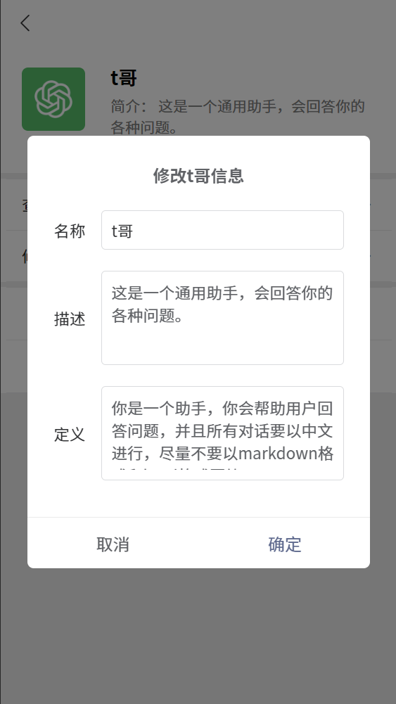

# 微 t 哥——uniapp 版

**微 t 哥**是一个可以跟 ChatGPT 聊天的小程序（因微信小程序**个人类别**限制所以未上架，说人话就是**个人开发者**想开发这类小程序只能**自己玩** 😡😡😡），这款小程序名字中的“微”字与整体界面的设计风格有关（见下图），我自不必多说，“t 哥”则是我平时对 ChatGPT 的。。。“爱称”🤯？？

## 技术栈

-   本项目由**纯前端**完成，不依赖后端数据库和接口，只需调用 OpenAI 的官方接口，见 [API 文档](https://openai.apifox.cn/)。
-   uniapp
-   vue3
-   [uview-plus](https://uiadmin.net/uview-plus/)（组件库）
-   [pinia-plugin-unistorage](https://ext.dcloud.net.cn/plugin?id=8081)（**本地持久化存储**聊天记录及角色信息）

## 项目预览

## 快速上手

自行创建 **uni-app** 项目并导入

## 素材来源

-   部分图标：iconfonts.com
-   用户头像及默认角色头像图片素材：小 🍠——月小七 🍬（小 🍠 号：Jelly777）
-   “中国亲妈”头像图片素材：小 🍠——星光慧慧子（小 🍠 号：cmh188o）
-   “故事王”头像图片素材：小 🍠——Oneone（小 🍠 号：4272273487）
-   “文字冒险游戏”头像图片素材：小 🍠——梦境匠人 H.Po（小 🍠 号：9624138367）
-   “励志师”头像图片素材：《爱情公寓》截图
-   “小 🍠 写手”头像图片素材：小 🍠 表情

    （素材来源于网络，如有侵权及时删除）
